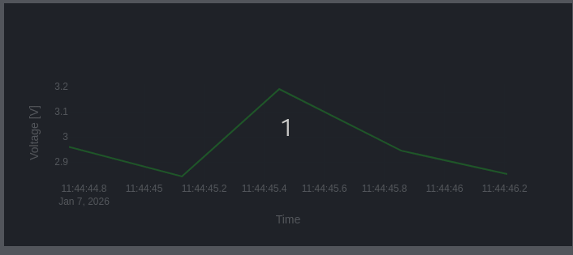
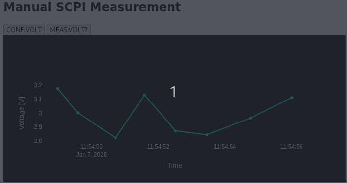

# Project Overview

SCPI Voltage measuements using FastAPI

Key Features:

1. SCPI Command Simulation
2. Async Backend
3. Frontend with Plotly
4. JSON Logging
5. HTTP hooks
6. Poetry Dependency management

Example frontend auto measure:

<p align="center">
  
</p>

Example frontend manual measure:

<p align="center">
  
</p>


## Start project
```bash
poetry run uvicorn app.main:app --reload
```
## Open Web server

http://127.0.0.1:8000/

## Optional: Test SCPI endpoints

.Conf
```bash
curl -X POST "http://127.0.0.1:8000/conf?mode=VOLT"


Output example: 
```bash
{"status":"OK","mode":"VOLT"}
```

.Measure
```bash
curl "http://127.0.0.1:8000/measure"
```


Output example: 
```bash
{"value":"3.018","timestamp":1767781488.1346893}


# FAQ

## AsyncIO funcionality:

1. Websocket handlers
```bash
@app.websocket("/ws/scpi")
async def ws_scpi(ws: WebSocket)
```
Multiple clients can connect simultaneously without blocking each other

FastAPI + uvicorn uses asyncio event loop to handle many connections concurrently


2. Transport lock
```bash
async with self.lock:
    return await self.device.handle(command)
```  
If two clients send SCPI commands at the same time, this ensures serialized access to the (simulated) device

Prevents race conditions that would happen on a real serial port


3. Device simulation

```bash
await asyncio.sleep(0.05)  # simulate I/O delay
```
Simulates non-blocking I/O (like real hardware response time).

Allows the event loop to serve other clients while waiting, providing real concurrency.


## Where is the data saved?
```bash
./scpi-fastapi/scpi_log.jsonl
```

## Pydantic Data validation

Checks Whether data types for Conf. and Measure. are correct
```bash
class ConfResponse(BaseModel):
    status: str
    mode: str

class MeasureResponse(BaseModel):
    value: float
    timestamp: float
```
